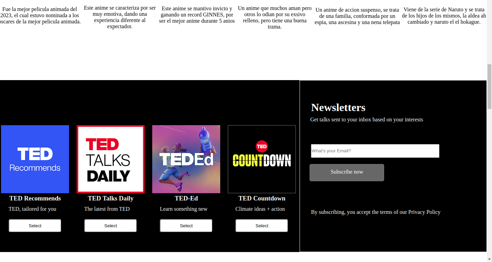

# proyecto de ted
Esto es una prueba 
sobre como se puedo
emaquetar el interior de
la pagina de ted.com. 
 
Esto realizo con HTML,
como tambien se le dio
estilo con CSS, fue una 
buena experiencia, fue un 
muy buen ejercicio a 
realizar.
